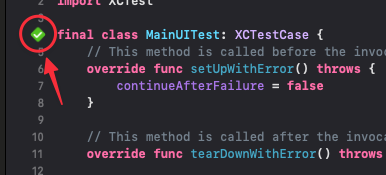

# BCC Media tvOS

This is the source code for the BCC Media tvOS app.

# Setup

Open BCC Media.xcworkspace and let xcode do the magic.

# Generate queries

Go to [API](./API) and run `make gql` to create query files for the Apollo Client.

# Tests

To run UI tests locally, click the little "Play" button to the left of the `MainUITest` class definition.  
This is required for the environment variables to be defined within the test scope.



# Release

```
make release
```

Should bump version and pushes a tag for the version. A CI/CD pipeline does the rest.

# Troubleshooting

## Updating signing certificates

Once in a while, you'll need to generate new code signing certificates for fastlanes release pipeline to work. We use [match](https://docs.fastlane.tools/actions/match/) for this.

To generate new certificates for tvOS, run the following command.

```
fastlane match appstore --platform tvos
```

This will generate new code signing certificates and place it [in your Apple Developer account](https://developer.apple.com/account/resources).

### After generating new certificates

When new certificates are generated, you'll have to update some environment variables for the fastlane Github Action to work;

- **CERTIFICATE_BASE64**  
  Export the certificate from Keychain Access and convert the contents to base64 format. You can do this by running this command and copying the output:

  ```
  cat ~/path/to/certificate.p12 | base64
  ```

  Update the secret in Github with the new base64 string.
