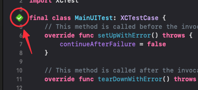

# BCC Media tvOS

This is the source code for the BCC Media tvOS app.

# Setup

Open BCC Media.xcworkspace and let xcode do the magic.

# Generate queries

Go to [API](./API) and run `make gql` to create query files for the Apollo Client.

# Tests

To run UI tests locally, click the little "Play" button to the left of the `MainUITest` class definition.  
This is required for the environment variables to be defined within the test scope.



# Release

Deploys run on **Semaphore** (`.semaphore/semaphore.yml`):

- Every push runs the tvOS UI tests.
- Every merge to `main` builds the app and uploads it to **TestFlight** (internal +
  Open beta). The build number is computed automatically from the latest TestFlight
  build, so you do not need to bump it manually.
- Releasing to the **App Store** is a manual step: from the finished `main` workflow
  in Semaphore, trigger the **Promote to App Store** promotion
  (`.semaphore/promote-app-store.yml`).

To start a new version line, bump `MARKETING_VERSION` (e.g. via the `release`
fastlane lane or directly in the Xcode project) and merge to `main`.

# Troubleshooting

## Updating signing certificates

Once in a while, you'll need to generate new code signing certificates for fastlanes release pipeline to work. We use [match](https://docs.fastlane.tools/actions/match/) for this.

To generate new certificates for tvOS, run the following command.

```
fastlane match appstore --platform tvos
```

This will generate new code signing certificates and place it [in your Apple Developer account](https://developer.apple.com/account/resources).

### After generating new certificates

The signing certificate is **shared** with brunstadtv-app via the `ios-signing-certs`
Semaphore secret (the tvOS app uses the same Apple Distribution cert and bundle id
`tv.brunstad.app`). When the cert rotates, refresh that shared secret — e.g. with
brunstadtv-app's `scripts/refresh-ios-signing-secrets.sh` — and both apps pick it up.
There is nothing tvOS-specific to update for signing.

The app-specific `tvos-ci` secret (login / analytics / feature-flag keys) is managed
with `scripts/setup-semaphore-secrets.sh`.
